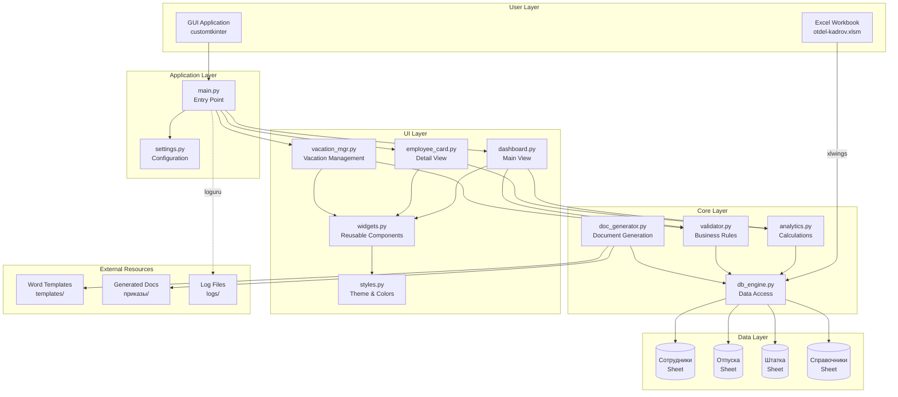

# Technical Design Document: HRMS System

## Overview

HRMS System представляет собой полнофункциональную систему управления человеческими ресурсами, построенную на архитектуре "Excel как база данных, Python как процессор". Система обеспечивает автоматизацию ключевых HR-процессов: контроль контрактов, управление отпусками и генерацию кадровых документов.

### Ключевые принципы архитектуры

1. **Разделение ответственности**: Excel хранит структурированные данные в виде таблиц (ручной ввод), Python обрабатывает бизнес-логику и читает данные
2. **Модульность**: Четкое разделение на backend (core/) и frontend (ui/)
3. **Интеграция через Excel**: Система запускается ТОЛЬКО из Excel через VBA макрос и xlwings
4. **Только чтение данных**: Python читает данные из Excel, но НЕ добавляет/редактирует сотрудников (это делается вручную в таблице)

### Технологический стек

- **Python 3.10+**: Основной язык разработки
- **xlwings**: Двунаправленная интеграция с Excel (запуск ТОЛЬКО из Excel через VBA)
- **pandas**: Обработка и анализ данных
- **openpyxl**: Чтение .xlsx без Excel
- **customtkinter**: Современный GUI
- **docxtpl**: Генерация Word документов
- **loguru**: Структурированное логирование
- **Pillow**: Обработка изображений для GUI

### Приоритеты реализации

**Фаза 1** (Основной функционал):
- Контроль контрактов (ВСЕ на 2-3 месяца вперед, группировка по месяцам, сортировки/фильтры)
- Дни рождения (30 дней вперед)
- Управление отпусками (добавление, редактирование, удаление)
- Проверка пересечений отпусков

**Фаза 2** (Документы и фильтрация):
- Генерация приказов (ОДИН типовой приказ с базовым набором данных)
- Автоматическая нумерация приказов с возможностью ручного ввода
- Фильтрация по подразделениям (Завод КТМ, Основное)

**Фаза 3** (Отложено):
- Штатка (НЕ В ПРИОРИТЕТЕ, оставить на самый конец)
- Детальная проработка каждого типа приказа

## Architecture

### High-Level Architecture



### Module Structure

```
hrms-system/
├── main.py                 # Application entry point (launched from Excel VBA)
├── settings.py             # Configuration management
├── requirements.txt        # Python dependencies
├── macro.vba              # Excel VBA integration (button in Excel)
├── core/                  # Backend modules
│   ├── __init__.py
│   ├── db_engine.py       # Excel data access layer
│   ├── analytics.py       # Metrics calculation engine
│   ├── validator.py       # Data validation & business rules
│   └── doc_generator.py   # Document generation from templates
├── ui/                    # Frontend modules
│   ├── __init__.py
│   ├── styles.py          # UI theme and styling
│   ├── widgets.py         # Reusable UI components
│   └── views/
│       ├── __init__.py
│       ├── dashboard.py   # Main dashboard view
│       ├── employee_card.py  # Employee detail/edit view
│       ├── vacation_mgr.py   # Vacation management view
│       └── order_generator.py # Order generation view
├── templates/             # Word document templates (user-provided)
│   ├── базовый_приказ.docx
│   └── (other templates added later)
├── приказы/               # Generated documents (RUSSIAN: orders)
├── личные_дела/           # Personal employee files (RUSSIAN: personal files)
│   ├── 001 Иванов Иван Иванович/
│   │   ├── паспорт.pdf
│   │   └── документы.pdf
│   └── 002 Петров Петр Петрович/
├── logs/                  # Application logs
└── otdel-kadrov.xlsm     # Excel database
    ├── Сотрудники        # Active employees (manual add, Python edit/terminate)
    ├── Архив             # Terminated employees (Python manages)
    ├── Отпуска           # Vacation records (Python manages)
    ├── Журнал событий    # Order log with auto-incrementing numbers (Python manages)
    ├── Настройки         # Reference lists (columns on one sheet)
    └── Штатка            # Staff table (NOT PRIORITY, later)
```

### Data Flow Patterns

#### Pattern 1: User Action → Data Modification
```
User Input (GUI) → Validator → DB Engine → Excel → Refresh GUI
```

#### Pattern 2: Excel Launch → Python Execution
```
Excel Button → VBA Macro → xlwings → Python Function → GUI Display
```

#### Pattern 3: Analytics Calculation
```
GUI Request → Analytics Engine → DB Engine → Excel → Pandas → Calculation → GUI Display
```

## Components and Interfaces

### 1. db_engine.py - Data Access Layer

**Responsibility**: Управление всеми операциями чтения/записи данных в Excel

**Key Classes**:

```python
class ExcelDatabase:
    """Main database interface for Excel workbook - READ ONLY for employees"""
    
    def __init__(self, workbook_path: str = None)
    def connect(self) -> bool
    def disconnect(self)
    def get_employees(self, filter_department: str = None) -> pd.DataFrame
    def get_employee_by_tab_number(self, tab_number: int) -> dict
    # NOTE: NO add_employee, update_employee, delete_employee - manual entry in Excel only
    def get_vacations(self, tab_number: int = None) -> pd.DataFrame
    def add_vacation(self, vacation_data: dict) -> int
    def update_vacation(self, vacation_id: int, vacation_data: dict) -> bool
    def delete_vacation(self, vacation_id: int) -> bool
    def get_staff_table(self) -> pd.DataFrame
    def get_references(self) -> dict
    def get_next_order_number(self, order_type: str) -> str
    def save_order_number(self, order_type: str, order_number: str) -> None
    def refresh_data(self)
```

**Key Methods**:

- `connect()`: Устанавливает соединение с Excel через xlwings.Book.caller() (запуск ТОЛЬКО из Excel)
- `get_employees(filter_department)`: Возвращает DataFrame сотрудников с опциональной фильтрацией по подразделению ("Завод КТМ" или "Основное")
- `get_employee_by_tab_number(tab_number)`: Возвращает данные сотрудника по табельному номеру
- `get_vacations(tab_number)`: Возвращает отпуска для конкретного сотрудника или все
- `get_references()`: Возвращает словарь справочников для выпадающих списков
- `get_next_order_number(order_type)`: Возвращает следующий номер приказа с автоинкрементом
- `save_order_number(order_type, order_number)`: Сохраняет последний использованный номер приказа

**Error Handling**:
- `DatabaseConnectionError`: Не удалось подключиться к Excel
- `SheetNotFoundError`: Требуемый лист не найден
- `DataIntegrityError`: Структура данных не соответствует ожидаемой

### 2. analytics.py - Calculation Engine

**Responsibility**: Расчет всех метрик и аналитических показателей

**Key Classes**:

```python
class AnalyticsEngine:
    """Calculation engine for HR metrics"""
    
    def __init__(self, db: ExcelDatabase)
    def calculate_age(self, birth_date: datetime) -> int
    def calculate_tenure(self, hire_date: datetime) -> tuple[int, int]
    def calculate_contract_days_remaining(self, contract_end: datetime) -> int
    def get_contract_alerts(self, months_ahead: int = 3) -> list[dict]
    def get_upcoming_birthdays(self, days_ahead: int = 30) -> list[dict]
    def calculate_vacation_used(self, tab_number: int, year: int) -> int
    def calculate_vacation_allowance(self, hire_date: datetime, year: int) -> int
    def calculate_vacation_remaining(self, tab_number: int, year: int) -> int
    def get_dashboard_statistics(self, filter_department: str = None) -> dict
```

**Key Algorithms**:

1. **Prorated Vacation Allowance**:
```python
def calculate_vacation_allowance(hire_date: datetime, year: int) -> int:
    """
    Calculates prorated vacation days for employees with < 1 year tenure
    Formula: (months_worked / 12) * annual_allowance
    """
    annual_allowance = 28  # Standard annual vacation days
    
    if hire_date.year < year:
        return annual_allowance
    
    months_worked = 12 - hire_date.month + 1
    return int((months_worked / 12) * annual_allowance)
```

2. **Contract Alert Priority**:
```python
def get_contract_alerts(months_ahead: int = 3) -> list[dict]:
    """
    Returns ALL contract alerts for next 2-3 months, grouped by month
    With sorting and filtering capabilities
    """
    employees = self.db.get_employees()
    alerts = []
    
    today = date.today()
    end_date = today + timedelta(days=months_ahead * 30)
    
    for _, emp in employees.iterrows():
        contract_end = emp['Конец контракта']
        
        if today <= contract_end <= end_date:
            days_remaining = (contract_end - today).days
            month_group = contract_end.strftime('%Y-%m')
            
            priority = 'HIGH' if days_remaining <= 7 else 'MEDIUM'
            alerts.append({
                'tab_number': emp['Таб. №'],
                'name': emp['ФИО'],
                'position': emp['Должность'],
                'department': emp['Подразделение'],
                'contract_end': contract_end,
                'days_remaining': days_remaining,
                'month_group': month_group,
                'priority': priority
            })
    
    return sorted(alerts, key=lambda x: x['contract_end'])
```

### 3. validator.py - Business Rules Engine

**Responsibility**: Валидация данных и проверка бизнес-правил

**Key Classes**:

```python
class DataValidator:
    """Validates data and enforces business rules"""
    
    def __init__(self, db: ExcelDatabase)
    def validate_vacation_data(self, vacation_data: dict) -> tuple[bool, str]
    def check_vacation_overlap(self, tab_number: int, start_date: datetime, 
                               end_date: datetime, vacation_id: int = None) -> tuple[bool, list]
    def validate_reference_value(self, field: str, value: str) -> tuple[bool, str]
    def validate_date_logic(self, start_date: datetime, end_date: datetime) -> tuple[bool, str]
```

**Validation Rules**:

1. **Vacation Data Validation**:
   - All required fields present (Таб. №, Дата начала, Дата окончания, Тип отпуска)
   - Start date not in past (or configurable grace period)
   - End date >= start date
   - Vacation type exists in references
   - Employee with given Таб. № exists

2. **Vacation Overlap Detection**:
```python
def check_vacation_overlap(self, tab_number: int, start_date: datetime, 
                          end_date: datetime, vacation_id: int = None) -> tuple[bool, list]:
    """
    Checks for vacation overlaps for the same employee
    Returns: (has_overlap, list_of_overlapping_vacations)
    """
    vacations = self.db.get_vacations(tab_number)
    
    if vacation_id:
        vacations = vacations[vacations['ID записи'] != vacation_id]
    
    overlaps = []
    for _, vac in vacations.iterrows():
        vac_start = vac['Дата начала']
        vac_end = vac['Дата окончания']
        
        # Check if date ranges overlap
        if not (end_date < vac_start or start_date > vac_end):
            overlaps.append({
                'id': vac['ID записи'],
                'start': vac_start,
                'end': vac_end,
                'type': vac['Тип отпуска']
            })
    
    return (len(overlaps) > 0, overlaps)
```

### 4. doc_generator.py - Document Generation

**Responsibility**: Генерация приказов из Word шаблонов

**Key Classes**:

```python
class DocumentGenerator:
    """Generates Word documents from templates with auto-numbering"""
    
    def __init__(self, db: ExcelDatabase, templates_dir: str, reports_dir: str)
    def generate_order(self, order_type: str, employee_tab_number: int, 
                      order_number: str = None, **kwargs) -> str
    def load_template(self, template_name: str) -> DocxTemplate
    def populate_template(self, template: DocxTemplate, context: dict) -> DocxTemplate
    def save_document(self, doc: DocxTemplate, filename: str) -> str
    def get_next_order_number(self, order_type: str) -> str
    def format_order_number(self, order_type: str, number: int) -> str
```

**Template Context Structure**:

```python
# Generic order context (базовый набор данных для ОДНОГО типового приказа)
{
    'order_number': '001-П',  # Автоматическая нумерация с возможностью ручного ввода
    'order_date': '2024-01-15',
    'order_type': 'Прием на работу',  # Один из типов из справочника "События"
    'employee_name': 'Иванов Иван Иванович',
    'tab_number': '12345',
    'position': 'Инженер',
    'department': 'Завод КТМ',
    'employment_rate': 1.0,
    'payment_form': 'Повременная',
    'contract_start': '2024-01-20',
    'contract_end': '2025-01-20',
    # Дополнительные поля в зависимости от типа приказа
    'additional_data': {}
}
```

**Автоматическая нумерация приказов**:
- Последний номер хранится в отдельном листе Excel "Настройки" или в settings
- Формат номера: {число}-{код_типа} (например, "001-П" для приема)
- При генерации предлагается следующий номер, но можно ввести вручную
- После сохранения номер запоминается для следующего раза

### 5. UI Components

#### styles.py - Theme Configuration

```python
class AppTheme:
    """Application theme and styling constants"""
    
    # Colors
    PRIMARY_COLOR = "#1f538d"
    SECONDARY_COLOR = "#14375e"
    ACCENT_COLOR = "#4CAF50"
    WARNING_COLOR = "#FF9800"
    DANGER_COLOR = "#F44336"
    BACKGROUND_COLOR = "#f5f5f5"
    CARD_BACKGROUND = "#ffffff"
    TEXT_PRIMARY = "#212121"
    TEXT_SECONDARY = "#757575"
    
    # Fonts
    FONT_FAMILY = "Segoe UI"
    FONT_SIZE_LARGE = 16
    FONT_SIZE_MEDIUM = 12
    FONT_SIZE_SMALL = 10
    
    # Spacing
    PADDING_LARGE = 20
    PADDING_MEDIUM = 10
    PADDING_SMALL = 5
```

#### widgets.py - Reusable Components

```python
class ContractAlertWidget(ctk.CTkFrame):
    """Widget displaying ALL contract expirations for next 2-3 months, grouped by month"""
    def __init__(self, parent, analytics: AnalyticsEngine)
    def refresh(self)
    def group_by_month(self, alerts: list) -> dict
    def apply_filters(self, department: str = None, sort_by: str = 'date')
    def on_alert_click(self, tab_number: int)

class BirthdayWidget(ctk.CTkFrame):
    """Widget displaying upcoming birthdays for next 30 days (1 month)"""
    def __init__(self, parent, analytics: AnalyticsEngine)
    def refresh(self)

class EmployeeListWidget(ctk.CTkFrame):
    """Scrollable list of employees with search (READ ONLY - no add/edit)"""
    def __init__(self, parent, db: ExcelDatabase)
    def set_filter(self, department: str)
    def search(self, query: str)
    def on_employee_select(self, tab_number: int)

class VacationCalendarWidget(ctk.CTkFrame):
    """Calendar view for vacation planning"""
    def __init__(self, parent, db: ExcelDatabase)
    def display_month(self, year: int, month: int)
    def highlight_vacations(self, vacations: list)
```

#### dashboard.py - Main View

```python
class DashboardView(ctk.CTkFrame):
    """Main dashboard with widgets and statistics"""
    
    def __init__(self, parent, db: ExcelDatabase, analytics: AnalyticsEngine)
    def setup_ui(self)
    def refresh_widgets(self)
    def apply_department_filter(self, department: str)
```

**Dashboard Layout**:
```
┌─────────────────────────────────────────────────────┐
│  HRMS Dashboard            [Завод КТМ ▼] [⟳]       │
├─────────────────────────────────────────────────────┤
│                                                      │
│  ┌──────────────────┐  ┌──────────────────┐        │
│  │ Контракты        │  │ Дни рождения     │        │
│  │ истекают         │  │ (30 дней)        │        │
│  │                  │  │                  │        │
│  │ Июнь 2024:       │  │ • Петров (15.06) │        │
│  │ • Иванов (5 дн)  │  │ • Козлов (18.06) │        │
│  │ • Сидоров (12дн) │  │ • Смирнов (22.06)│        │
│  │                  │  │                  │        │
│  │ Июль 2024:       │  │                  │        │
│  │ • Петров (35 дн) │  │                  │        │
│  │ [Сортировка ▼]   │  │                  │        │
│  └──────────────────┘  └──────────────────┘        │
│                                                      │
│  ┌──────────────────────────────────────────────┐  │
│  │ Статистика                                    │  │
│  │ Всего сотрудников: 45                        │  │
│  │ Завод КТМ: 30  |  Основное: 15               │  │
│  └──────────────────────────────────────────────┘  │
│                                                      │
└─────────────────────────────────────────────────────┘
```

#### employee_card.py - Detail View

```python
class EmployeeCardView(ctk.CTkFrame):
    """Detailed employee information and actions (READ ONLY for employee data)"""
    
    def __init__(self, parent, db: ExcelDatabase, analytics: AnalyticsEngine, 
                 validator: DataValidator, doc_gen: DocumentGenerator)
    def load_employee(self, tab_number: int)
    def generate_document(self, doc_type: str, order_number: str = None)
    def display_metrics(self)
    def display_vacations(self)
```

#### vacation_mgr.py - Vacation Management

```python
class VacationManagerView(ctk.CTkFrame):
    """Vacation management with calendar and validation"""
    
    def __init__(self, parent, db: ExcelDatabase, validator: DataValidator)
    def load_employee_vacations(self, tab_number: int)
    def add_vacation(self)
    def edit_vacation(self, vacation_id: int)
    def delete_vacation(self, vacation_id: int)
    def validate_and_save(self, vacation_data: dict)
    def display_overlap_warning(self, overlaps: list)
```

## Data Models

### Excel Sheet Structures

#### Sheet: Сотрудники (Employees)

| Column | Type | Description | Constraints |
|--------|------|-------------|-------------|
| Таб. № | Integer | Employee number | Primary Key, Unique |
| ФИО | String | Full name | Required, Non-empty |
| Подразделение | String | Department | Required, "Завод КТМ" or "Основное" |
| Должность | String | Position | Required, From references |
| Дата принятия | Date | Hire date | Required |
| Дата рождения | Date | Birth date | Required, Past date |
| Пол | String | Gender | "М" or "Ж" |
| Гражданин РБ | String | Citizen of Belarus | "Да" or "Нет" |
| Резидент РБ | String | Resident of Belarus | "Да" or "Нет" |
| Пенсионер | String | Pensioner status | "Да" or "Нет" |
| Форма оплаты | String | Payment form | From references |
| Ставка | Float | Employment rate | From references (0.2, 0.25, 0.5, 1) |
| Начало контракта | Date | Contract start date | >= Дата принятия |
| Конец контракта | Date | Contract end date | >= Начало контракта |
| Личный № | String | Personal number | Optional |
| Страховой № | String | Insurance number | Optional |
| № паспорта | String | Passport number | Optional |
| Путь к личному делу | String | Path to personal file folder | Optional, auto-created on hire |

**Note**: Все названия колонок БЕЗ подчеркиваний, с обычными пробелами. Доступ в pandas: `df['Дата рождения']`

#### Sheet: Отпуска (Vacations)

| Column | Type | Description | Constraints |
|--------|------|-------------|-------------|
| ID записи | Integer | Unique vacation record ID | Primary Key, Auto-increment |
| Таб. № | Integer | Employee tab number | Foreign Key → Сотрудники.Таб. № |
| ФИО | String | Employee name | Denormalized for display |
| Дата начала | Date | Vacation start date | Required |
| Дата окончания | Date | Vacation end date | Required, >= Дата начала |
| Тип отпуска | String | Vacation type | From references |
| Количество дней | Integer | Duration in days | Auto-calculated |

**Note**: Лист "Отпуска" создается в том же файле, привязка к сотруднику через Таб. №

#### Sheet: Штатка (Staff Table)

| Column | Type | Description | Constraints |
|--------|------|-------------|-------------|
| Подразделение | String | Department name | Required |
| Должность | String | Position title | Required |
| Оклад мин | Float | Minimum salary | Required, > 0 |
| Оклад макс | Float | Maximum salary | Required, >= Оклад мин |
| Количество ставок | Integer | Number of positions | Required, >= 0 |

**Note**: Штатка НЕ В ПРИОРИТЕТЕ, оставить на самый конец

#### Sheet: Журнал событий (Order Log)

| Column | Type | Description | Constraints |
|--------|------|-------------|-------------|
| Номер приказа | Integer | Order number | Primary Key, Auto-increment |
| Тип события | String | Event/order type | From references (События) |
| Дата создания | Date | Order creation date | Auto-filled |
| Таб. № | Integer | Employee tab number | Foreign Key → Сотрудники.Таб. № |
| ФИО | String | Employee name | Denormalized for display |
| Путь к файлу | String | Path to generated document | приказы/... (RUSSIAN folder name) |
| Дополнительные данные | String | JSON with order-specific data | Optional |

**Note**: 
- Автоматическая нумерация: последний номер + 1
- Возможность ручного ввода номера при создании приказа
- Каждый сгенерированный приказ = новая строка в журнале

#### Sheet: Настройки (Settings/References)

**Note**: Это НЕ отдельные листы, а колонки на ОДНОМ листе "Настройки"

| Column | Type | Description |
|--------|------|-------------|
| Должность | String | List of positions (Вахтер, Ведущий бухгалтер, Ведущий специалист по продаже, Водитель автомобиля, Водитель погрузчика, Генеральный директор, Главный бухгалтер, Главный инженер, Заведующий складом, Загрузчик-выгрузчик) |
| События | String | List of events/order types (Больничный, Отпуск за свой счет, Отпуск трудовой, Перевод, Прием на работу, Продление контракта, Увольнение) |
| Подразделение | String | List of departments (Завод КТМ, Основное) |
| Форма оплаты | String | Payment forms (Сдельная, Повременная) |
| Ставка | String | Employment rates (0.2, 0.25, 0.5, 1) |

### Python Data Models

```python
from dataclasses import dataclass
from datetime import datetime
from typing import Optional

@dataclass
class Employee:
    tab_number: int  # Таб. №
    full_name: str  # ФИО
    department: str  # Подразделение (Завод КТМ, Основное)
    position: str  # Должность
    hire_date: datetime  # Дата принятия
    birth_date: datetime  # Дата рождения
    gender: str  # Пол (М, Ж)
    citizen_rb: str  # Гражданин РБ (Да, Нет)
    resident_rb: str  # Резидент РБ (Да, Нет)
    pensioner: str  # Пенсионер (Да, Нет)
    payment_form: str  # Форма оплаты
    employment_rate: float  # Ставка
    contract_start: datetime  # Начало контракта
    contract_end: datetime  # Конец контракта
    personal_number: Optional[str] = None  # Личный №
    insurance_number: Optional[str] = None  # Страховой №
    passport_number: Optional[str] = None  # № паспорта
    personal_file_path: Optional[str] = None  # Путь к личному делу
    
    # Calculated fields
    age: Optional[int] = None
    tenure_years: Optional[int] = None
    tenure_months: Optional[int] = None
    contract_days_remaining: Optional[int] = None
    
    # Note: Access DataFrame columns with spaces like: df['Дата рождения']

@dataclass
class Vacation:
    id: int  # ID записи
    tab_number: int  # Таб. №
    employee_name: str  # ФИО
    start_date: datetime  # Дата начала
    end_date: datetime  # Дата окончания
    vacation_type: str  # Тип отпуска
    duration_days: int  # Количество дней

@dataclass
class OrderLogEntry:
    order_number: int  # Номер приказа
    order_type: str  # Тип события
    creation_date: datetime  # Дата создания
    tab_number: int  # Таб. №
    employee_name: str  # ФИО
    file_path: str  # Путь к файлу
    additional_data: Optional[str] = None  # JSON с доп. данными

@dataclass
class ContractAlert:
    tab_number: int
    employee_name: str
    position: str
    department: str
    contract_end: datetime
    days_remaining: int
    month_group: str  # YYYY-MM for grouping
    priority: str  # "HIGH", "MEDIUM"

@dataclass
class Birthday:
    tab_number: int
    employee_name: str
    birth_date: datetime
    age_on_birthday: int
    days_until: int
```


## Correctness Properties

*A property is a characteristic or behavior that should hold true across all valid executions of a system—essentially, a formal statement about what the system should do. Properties serve as the bridge between human-readable specifications and machine-verifiable correctness guarantees.*


### Property 1: Excel-Python Data Round-Trip Preservation

*For any* valid DataFrame containing employee, vacation, staff, or reference data, serializing to Excel then parsing back to DataFrame SHALL produce an equivalent DataFrame with preserved structure and values.

**Validates: Requirements 13.5, 13.3**

### Property 2: Contract Alert Generation with Grouping

*For any* employee with a contract end date within the next 2-3 months, the system SHALL correctly calculate days remaining, generate a Contract_Alert with HIGH priority if <= 7 days or MEDIUM priority otherwise, group alerts by month (YYYY-MM), and include tab_number, employee name, position, department, contract_end, days_remaining, and month_group.

**Validates: Requirements 3.1, 3.2, 3.3, 3.5**

### Property 3: Birthday Calculation and Sorting

*For any* set of employees, the system SHALL correctly identify birthdays within the next 30 days, calculate age on birthday, and return results sorted by date (earliest first).

**Validates: Requirements 4.1, 4.2, 4.3**

### Property 4: Vacation Overlap Detection

*For any* employee (identified by tab_number) and vacation date range, the system SHALL detect overlaps with existing vacations for the same employee, prevent creation if overlap exists, and allow creation if dates do not overlap regardless of vacation type.

**Validates: Requirements 5.1, 5.2, 5.3**

### Property 5: Vacation Duration Auto-Calculation

*For any* vacation record with start and end dates, the system SHALL automatically calculate duration in days as (end_date - start_date + 1).

**Validates: Requirements 5.4**

### Property 6: Age Calculation Accuracy

*For any* employee birth date and current date, the system SHALL calculate age as the number of complete years between birth date and current date.

**Validates: Requirements 6.1**

### Property 7: Tenure Calculation Accuracy

*For any* employee hire date and current date, the system SHALL calculate tenure in complete years and remaining months.

**Validates: Requirements 6.2**

### Property 8: Vacation Days Used Summation

*For any* employee (identified by tab_number) and year, the system SHALL calculate total vacation days used by summing duration_days from all vacation records in that year.

**Validates: Requirements 6.3**

### Property 9: Vacation Days Remaining Calculation

*For any* employee (identified by tab_number) and year, the system SHALL calculate vacation days remaining as (annual_allowance - days_used), where annual_allowance is 28 for tenure >= 1 year or prorated for tenure < 1 year.

**Validates: Requirements 6.4, 6.5**

### Property 10: Date Range Validation

*For any* pair of dates representing a range (start_date, end_date), the validator SHALL reject the input if start_date > end_date, including vacation dates and hire/termination dates.

**Validates: Requirements 7.1, 7.2**

### Property 11: Vacation Required Fields Validation

*For any* vacation data submission, the validator SHALL verify that all required fields (Таб. №, Дата начала, Дата окончания, Тип отпуска) are non-empty and reject if any are missing.

**Validates: Requirements 7.3**

### Property 12: Reference Value Validation

*For any* field that references справочники (department, position, vacation type, citizenship), the validator SHALL verify the value exists in the corresponding reference list and reject if not found.

**Validates: Requirements 7.4**

### Property 13: Validation Failure Prevention

*For any* validation failure, the system SHALL prevent data save and return a descriptive error message indicating which validation rule failed.

**Validates: Requirements 7.5**

### Property 14: Document Order Number Auto-Generation

*For any* order type, the system SHALL generate the next sequential order number in format {number:03d}-{code}, store the last used number, and allow manual override of the suggested number.

**Validates: Requirements 8.2, 8.4**

### Property 15: Document Template Population

*For any* employee (identified by tab_number) and order type, the document generator SHALL populate the template with all employee data fields from Excel_Database and produce a valid .docx file.

**Validates: Requirements 8.2**

### Property 16: Document Filename Convention

*For any* generated document, the filename SHALL follow the format "{тип_приказа} {ФИО} {дата}.docx" (БЕЗ подчеркиваний, с пробелами) and be saved in the приказы/ directory.

**Validates: Requirements 8.4**

### Property 17: Department Filter Application

*For any* filter selection ("Завод КТМ", "Основное", or "Все"), the system SHALL display only employees where Подразделение matches the filter, or all employees if filter is "Все".

**Validates: Requirements 9.2, 9.4**

### Property 18: Department Value Constraint

*For any* employee record in Excel_Database, the Подразделение column SHALL contain only "Завод КТМ" or "Основное" as valid values.

**Validates: Requirements 1.6**

### Property 19: No Merged Cells in Data Tables

*For any* data table sheet (Сотрудники, Отпуска, Штатка, Справочники), the data range SHALL NOT contain merged cells.

**Validates: Requirements 1.5**

### Property 20: Python-Excel Vacation Sync

*For any* vacation data modification made in Python_Backend, the change SHALL be immediately reflected in Excel_Database when accessed.

**Validates: Requirements 2.3**

### Property 21: Error Logging Completeness

*For any* error that occurs in the system, a log entry SHALL be created containing timestamp, module name, error message, and stack trace.

**Validates: Requirements 12.1**

### Property 22: GUI Error Display

*For any* error that occurs in GUI_Application, a user-friendly error message SHALL be displayed to the user.

**Validates: Requirements 12.2**

### Property 23: Data Modification Logging

*For any* data modification (create, update, delete), a log entry SHALL be created containing user action, timestamp, and affected record identifiers.

**Validates: Requirements 12.3**

### Property 24: Log Filename Convention

*For any* log file created by the system, the filename SHALL follow the format hrms_{date}.log and be stored in the logs/ directory.

**Validates: Requirements 12.5**

### Property 25: Excel Sheet Parsing Success

*For any* valid Excel_Database with correct structure, the Python_Backend SHALL successfully parse all sheets (Сотрудники, Отпуска, Штатка, Справочники) into pandas DataFrames without errors.

**Validates: Requirements 13.1**

### Property 26: DataFrame Serialization Success

*For any* valid DataFrame, the Python_Backend SHALL successfully serialize it back to Excel_Database without data loss.

**Validates: Requirements 13.2**

### Property 27: Excel Launch Workbook Detection

*For any* launch from Excel via VBA macro, the system SHALL automatically detect and use the calling workbook without requiring manual file path specification.

**Validates: Requirements 15.4**

## Error Handling

### Error Categories

The system implements comprehensive error handling across four categories:

#### 1. Data Access Errors

**DatabaseConnectionError**
- Trigger: Excel file not found or cannot be opened
- Handling: Display error dialog with file path, log error, prevent application start
- User Message: "Не удалось открыть базу данных Excel: {file_path}. Проверьте, что файл существует и не открыт в другом приложении."

**SheetNotFoundError**
- Trigger: Required sheet missing from Excel workbook
- Handling: Display error dialog with sheet name, log error, prevent application start
- User Message: "Лист '{sheet_name}' не найден в базе данных. Проверьте структуру файла."

**DataIntegrityError**
- Trigger: Sheet structure doesn't match expected columns
- Handling: Display error dialog with expected vs actual structure, log error
- User Message: "Структура листа '{sheet_name}' не соответствует ожидаемой. Ожидаемые колонки: {expected_columns}"

#### 2. Validation Errors

**ValidationError**
- Trigger: Business rule violation (date logic, required fields, reference values, salary range)
- Handling: Display error message in GUI, prevent save, highlight invalid field
- User Message: Descriptive message specific to validation rule (e.g., "Дата окончания контракта не может быть раньше даты приема")

**VacationOverlapError**
- Trigger: Vacation dates overlap with existing vacation for same employee
- Handling: Display error with details of overlapping vacation, prevent save
- User Message: "Отпуск пересекается с существующим: {existing_vacation_dates} ({vacation_type})"

#### 3. Document Generation Errors

**TemplateNotFoundError**
- Trigger: Word template file missing from templates/ directory
- Handling: Display error dialog with template name, log error
- User Message: "Шаблон документа '{template_name}' не найден в папке templates/"

**TemplateMissingVariableError**
- Trigger: Template contains variable not present in data context
- Handling: Display error with variable name, log error, prevent document generation
- User Message: "В шаблоне используется переменная '{variable_name}', которая отсутствует в данных"

**DocumentSaveError**
- Trigger: Cannot save generated document to приказы/ directory
- Handling: Display error dialog, log error with full path
- User Message: "Не удалось сохранить документ: {file_path}. Проверьте права доступа к папке."

#### 4. System Errors

**ConfigurationError**
- Trigger: Invalid or missing configuration in settings.py
- Handling: Use default values, log warning
- User Message: "Используются настройки по умолчанию. Проверьте файл settings.py."

**LogRotationError**
- Trigger: Cannot rotate log file (disk full, permissions)
- Handling: Continue logging to current file, display warning
- User Message: None (silent fallback)

### Error Handling Strategy

```python
# Example error handling pattern
def add_vacation(self, vacation_data: dict) -> int:
    """Add new vacation with comprehensive error handling"""
    try:
        # Validate data
        is_valid, error_msg = self.validator.validate_vacation_data(vacation_data)
        if not is_valid:
            raise ValidationError(error_msg)
        
        # Check for overlaps
        has_overlap, overlaps = self.validator.check_vacation_overlap(
            vacation_data['tab_number'],
            vacation_data['start_date'],
            vacation_data['end_date']
        )
        if has_overlap:
            raise VacationOverlapError(f"Отпуск пересекается с существующими: {overlaps}")
        
        # Check references
        is_valid, error_msg = self.validator.validate_reference_value(
            'vacation_type', vacation_data['vacation_type']
        )
        if not is_valid:
            raise ValidationError(error_msg)
        
        # Add to database
        vacation_id = self.db.add_vacation(vacation_data)
        
        # Log success
        logger.info(f"Added vacation: {vacation_data['employee_name']} (ID: {vacation_id})")
        
        return vacation_id
        
    except ValidationError as e:
        logger.warning(f"Validation failed for vacation: {e}")
        raise  # Re-raise for GUI to handle
        
    except VacationOverlapError as e:
        logger.warning(f"Vacation overlap detected: {e}")
        raise
        
    except DatabaseConnectionError as e:
        logger.error(f"Database error while adding vacation: {e}")
        raise
        
    except Exception as e:
        logger.error(f"Unexpected error adding vacation: {e}", exc_info=True)
        raise SystemError(f"Произошла непредвиденная ошибка: {str(e)}")
```

### Logging Strategy

```python
# Logging configuration using loguru
from loguru import logger

logger.add(
    "logs/hrms_{time:YYYY-MM-DD}.log",
    rotation="10 MB",
    retention="30 days",
    level="INFO",
    format="{time:YYYY-MM-DD HH:mm:ss} | {level: <8} | {name}:{function}:{line} | {message}"
)

# Debug mode configuration
if settings.DEBUG_MODE:
    logger.add(
        "logs/hrms_debug_{time:YYYY-MM-DD}.log",
        rotation="10 MB",
        retention="7 days",
        level="DEBUG",
        format="{time:YYYY-MM-DD HH:mm:ss.SSS} | {level: <8} | {name}:{function}:{line} | {message}"
    )
```

**Log Levels**:
- **DEBUG**: Detailed data operations (DataFrame shapes, SQL-like queries, data transformations)
- **INFO**: Normal operations (employee added, vacation created, document generated)
- **WARNING**: Validation failures, configuration issues, recoverable errors
- **ERROR**: Database errors, file I/O errors, unexpected exceptions
- **CRITICAL**: System failures that prevent application start

## Testing Strategy

### Dual Testing Approach

The HRMS system requires both unit testing and property-based testing for comprehensive coverage:

**Unit Tests**: Focus on specific examples, edge cases, and integration points
- Specific employee records with known values
- Edge cases (empty data, boundary dates, special characters)
- Error conditions (missing files, invalid structure)
- Integration between components (db_engine ↔ analytics)

**Property-Based Tests**: Verify universal properties across all inputs
- Generate random employee data and verify calculations
- Test validation rules with wide range of inputs
- Verify round-trip serialization with various data types
- Ensure business rules hold for all possible scenarios

### Property-Based Testing Framework

**Library**: `hypothesis` for Python
- Generates random test data based on strategies
- Automatically finds edge cases and counterexamples
- Shrinks failing examples to minimal reproducible cases

**Configuration**:
```python
from hypothesis import given, settings, strategies as st

# Configure hypothesis for thorough testing
settings.register_profile("ci", max_examples=100, deadline=None)
settings.register_profile("dev", max_examples=50, deadline=1000)
settings.load_profile("ci")  # Use in CI/CD pipeline
```

### Test Organization

```
tests/
├── unit/
│   ├── test_db_engine.py          # Database operations
│   ├── test_analytics.py          # Calculation functions
│   ├── test_validator.py          # Validation rules
│   ├── test_doc_generator.py      # Document generation
│   └── test_integration.py        # Component integration
├── property/
│   ├── test_properties_data.py    # Properties 1, 18-20, 25-27
│   ├── test_properties_analytics.py  # Properties 2-3, 6-9
│   ├── test_properties_validation.py # Properties 4-5, 10-14
│   ├── test_properties_documents.py  # Properties 15-16
│   └── test_properties_logging.py    # Properties 21-24
├── fixtures/
│   ├── sample_employees.xlsx      # Test data
│   ├── sample_templates.docx      # Test templates
│   └── conftest.py                # Pytest fixtures
└── README.md                      # Testing documentation
```

### Property Test Examples

#### Property 1: Excel-Python Data Round-Trip

```python
from hypothesis import given, strategies as st
import pandas as pd
from core.db_engine import ExcelDatabase

@given(
    employees=st.lists(
        st.fixed_dictionaries({
            'Таб. №': st.integers(min_value=1, max_value=10000),
            'ФИО': st.text(min_size=5, max_size=50),
            'Дата рождения': st.dates(min_value=date(1950, 1, 1), max_value=date(2005, 12, 31)),
            'Дата принятия': st.dates(min_value=date(2010, 1, 1), max_value=date.today()),
            'Конец контракта': st.dates(min_value=date.today(), max_value=date(2030, 12, 31)),
            'Подразделение': st.sampled_from(['Завод КТМ', 'Основное']),
            'Должность': st.sampled_from(['Инженер', 'Менеджер', 'Разработчик']),
        }),
        min_size=1,
        max_size=20
    )
)
@settings(max_examples=100)
def test_excel_roundtrip_preserves_data(employees):
    """
    Feature: hrms-system, Property 1: Excel-Python Data Round-Trip Preservation
    For any valid DataFrame, serializing to Excel then parsing back SHALL produce equivalent DataFrame
    """
    db = ExcelDatabase('test_workbook.xlsx')
    
    # Create DataFrame
    df_original = pd.DataFrame(employees)
    
    # Write to Excel (for testing purposes only - in production, employees are added manually)
    db.write_employees(df_original)
    
    # Read back
    df_roundtrip = db.get_employees()
    
    # Assert equivalence
    pd.testing.assert_frame_equal(df_original, df_roundtrip, check_dtype=True)
```

#### Property 2: Contract Alert Generation

```python
@given(
    hire_date=st.dates(min_value=date(2020, 1, 1), max_value=date.today()),
    days_until_end=st.integers(min_value=1, max_value=60)
)
@settings(max_examples=100)
def test_contract_alert_generation_with_grouping(hire_date, days_until_end):
    """
    Feature: hrms-system, Property 2: Contract Alert Generation with Grouping
    For any employee with contract end date, system SHALL generate alert with correct priority and month grouping
    """
    contract_end = date.today() + timedelta(days=days_until_end)
    
    employee = {
        'Таб. №': 1,
        'ФИО': 'Test Employee',
        'Дата принятия': hire_date,
        'Конец контракта': contract_end,
        'Должность': 'Test Position',
        'Подразделение': 'Завод КТМ'
    }
    
    analytics = AnalyticsEngine(db)
    alerts = analytics.get_contract_alerts(months_ahead=3)
    
    # Check if alert should be generated (within 3 months)
    if days_until_end <= 90:
        assert len(alerts) > 0
        alert = alerts[0]
        
        # Verify priority
        if days_until_end <= 7:
            assert alert['priority'] == 'HIGH'
        else:
            assert alert['priority'] == 'MEDIUM'
        
        # Verify required fields
        assert 'tab_number' in alert
        assert 'name' in alert
        assert 'position' in alert
        assert 'department' in alert
        assert 'contract_end' in alert
        assert 'days_remaining' in alert
        assert 'month_group' in alert
        assert alert['days_remaining'] == days_until_end
        assert alert['month_group'] == contract_end.strftime('%Y-%m')
```

#### Property 4: Vacation Overlap Detection

```python
@given(
    existing_start=st.dates(min_value=date(2024, 1, 1), max_value=date(2024, 6, 30)),
    existing_duration=st.integers(min_value=7, max_value=28),
    new_start=st.dates(min_value=date(2024, 1, 1), max_value=date(2024, 12, 31)),
    new_duration=st.integers(min_value=7, max_value=28)
)
@settings(max_examples=100)
def test_vacation_overlap_detection(existing_start, existing_duration, new_start, new_duration):
    """
    Feature: hrms-system, Property 4: Vacation Overlap Detection
    For any vacation date range, system SHALL detect overlaps with existing vacations
    """
    existing_end = existing_start + timedelta(days=existing_duration - 1)
    new_end = new_start + timedelta(days=new_duration - 1)
    
    # Add existing vacation
    db.add_vacation({
        'Таб. №': 1,
        'Дата начала': existing_start,
        'Дата окончания': existing_end,
        'Тип отпуска': 'Ежегодный'
    })
    
    validator = DataValidator(db)
    has_overlap, overlaps = validator.check_vacation_overlap(
        tab_number=1,
        start_date=new_start,
        end_date=new_end
    )
    
    # Calculate expected overlap
    expected_overlap = not (new_end < existing_start or new_start > existing_end)
    
    assert has_overlap == expected_overlap
    
    if expected_overlap:
        assert len(overlaps) > 0
    else:
        assert len(overlaps) == 0
```

### Unit Test Examples

#### Edge Case: Empty Excel File

```python
def test_empty_excel_file_handling():
    """Test system handles empty Excel file gracefully"""
    db = ExcelDatabase('empty_workbook.xlsx')
    
    with pytest.raises(DataIntegrityError) as exc_info:
        db.connect()
    
    assert "Структура листа" in str(exc_info.value)
```

#### Integration: Analytics with Database

```python
def test_analytics_integration_with_database():
    """Test analytics engine correctly integrates with database"""
    # Setup test data (manually in Excel, or for testing purposes)
    db = ExcelDatabase('test_workbook.xlsx')
    
    # Note: In production, employees are added manually in Excel
    # For testing, we can write directly to test the analytics
    
    analytics = AnalyticsEngine(db)
    
    # Test age calculation
    age = analytics.calculate_age(date(1990, 5, 15))
    assert age == 34  # As of 2024
    
    # Test tenure calculation
    years, months = analytics.calculate_tenure(date(2020, 1, 10))
    assert years == 4
    assert months >= 0 and months < 12
```

### Test Coverage Goals

- **Unit Test Coverage**: Minimum 80% code coverage
- **Property Test Coverage**: All 27 correctness properties implemented
- **Integration Test Coverage**: All component interactions tested
- **Edge Case Coverage**: All error conditions and boundary cases tested

### Continuous Integration

```yaml
# .github/workflows/test.yml
name: HRMS Tests

on: [push, pull_request]

jobs:
  test:
    runs-on: windows-latest  # Required for xlwings
    
    steps:
      - uses: actions/checkout@v2
      
      - name: Set up Python
        uses: actions/setup-python@v2
        with:
          python-version: '3.10'
      
      - name: Install dependencies
        run: |
          pip install -r requirements.txt
          pip install pytest pytest-cov hypothesis
      
      - name: Run unit tests
        run: pytest tests/unit/ --cov=core --cov=ui --cov-report=xml
      
      - name: Run property tests
        run: pytest tests/property/ --hypothesis-profile=ci
      
      - name: Upload coverage
        uses: codecov/codecov-action@v2
```

### Test Execution Commands

```bash
# Run all tests
pytest tests/

# Run only unit tests
pytest tests/unit/

# Run only property tests
pytest tests/property/

# Run with coverage report
pytest tests/ --cov=core --cov=ui --cov-report=html

# Run specific property test
pytest tests/property/test_properties_data.py::test_excel_roundtrip_preserves_data -v

# Run with hypothesis statistics
pytest tests/property/ --hypothesis-show-statistics
```

---

## Appendix A: Configuration File Structure

### settings.py

```python
"""
HRMS System Configuration
"""
from pathlib import Path

# Base paths
BASE_DIR = Path(__file__).parent
EXCEL_FILE = BASE_DIR / "otdel-kadrov.xlsm"
TEMPLATES_DIR = BASE_DIR / "templates"
REPORTS_DIR = BASE_DIR / "приказы"  # RUSSIAN: orders
LOGS_DIR = BASE_DIR / "logs"

# Create directories if they don't exist
REPORTS_DIR.mkdir(exist_ok=True)
LOGS_DIR.mkdir(exist_ok=True)

# Personal files
PERSONAL_FILES_DIR = BASE_DIR / "личные_дела"  # RUSSIAN: personal files
PERSONAL_FILES_DIR.mkdir(exist_ok=True)

# Alert thresholds
CONTRACT_ALERT_MONTHS_AHEAD = 3  # Show all contracts expiring in next 2-3 months
CONTRACT_ALERT_HIGH_PRIORITY_DAYS = 7
BIRTHDAY_ALERT_DAYS_AHEAD = 30  # Show birthdays for next 30 days (1 month)

# Vacation settings
ANNUAL_VACATION_DAYS = 28

# Logging settings
LOG_ROTATION_SIZE = "10 MB"
LOG_RETENTION_DAYS = 30
DEBUG_MODE = False

# UI settings
WINDOW_WIDTH = 1200
WINDOW_HEIGHT = 800
WINDOW_TITLE = "HRMS - Система управления персоналом"

# Excel sheet names
SHEET_EMPLOYEES = "Сотрудники"
SHEET_ARCHIVE = "Архив"
SHEET_VACATIONS = "Отпуска"
SHEET_ORDER_LOG = "Журнал событий"
SHEET_SETTINGS = "Настройки"
SHEET_STAFF_TABLE = "Штатка"  # NOT PRIORITY

# Column mappings
EMPLOYEE_COLUMNS = [
    "Таб. №", "ФИО", "Подразделение", "Должность", "Дата принятия", 
    "Дата рождения", "Пол", "Гражданин РБ", "Резидент РБ", "Пенсионер",
    "Форма оплаты", "Ставка", "Начало контракта", "Конец контракта",
    "Личный №", "Страховой №", "№ паспорта", "Путь к личному делу"
]

VACATION_COLUMNS = [
    "ID записи", "ID сотрудника", "ФИО", "Дата начала", 
    "Дата окончания", "Тип отпуска", "Количество дней"
]

STAFF_TABLE_COLUMNS = [
    "Подразделение", "Должность", "Оклад мин", "Оклад макс", "Количество ставок"
]

REFERENCE_COLUMNS = [
    "Должность", "События", "Подразделение", "Форма оплаты", "Ставка"
]

# Valid values
VALID_DEPARTMENTS = ["Завод КТМ", "Основное"]
VALID_GENDERS = ["М", "Ж"]
VALID_YES_NO = ["Да", "Нет"]

# Order numbering
ORDER_NUMBER_STORAGE = "Настройки"  # Sheet name for storing last order numbers
ORDER_NUMBER_FORMAT = "{number:03d}-{code}"  # e.g., "001-П"

# Event types (for order generation)
EVENT_TYPES = [
    "Больничный",
    "Отпуск за свой счет",
    "Отпуск трудовой",
    "Перевод",
    "Прием на работу",
    "Продление контракта",
    "Увольнение"
]
```

## Appendix B: Dependencies

### requirements.txt

```txt
# Core dependencies
python>=3.10

# Excel integration
xlwings>=0.30.0
openpyxl>=3.1.0

# Data processing
pandas>=2.0.0
numpy>=1.24.0

# GUI
customtkinter>=5.2.0
Pillow>=10.0.0

# Document generation
docxtpl>=0.16.0
python-docx>=0.8.11

# Logging
loguru>=0.7.0

# Testing
pytest>=7.4.0
pytest-cov>=4.1.0
hypothesis>=6.82.0

# Development
black>=23.0.0
flake8>=6.0.0
mypy>=1.4.0
```

## Appendix C: API Reference Summary

### Core Module APIs

#### db_engine.ExcelDatabase

```python
connect() -> bool
disconnect() -> None
get_employees(filter_department: str = None) -> pd.DataFrame
get_employee_by_tab_number(tab_number: int) -> dict
# NOTE: NO add/update/delete employee methods - manual entry in Excel only
get_vacations(tab_number: int = None) -> pd.DataFrame
add_vacation(vacation_data: dict) -> int
update_vacation(vacation_id: int, vacation_data: dict) -> bool
delete_vacation(vacation_id: int) -> bool
get_staff_table() -> pd.DataFrame
get_references() -> dict
get_next_order_number(order_type: str) -> str
save_order_number(order_type: str, order_number: str) -> None
refresh_data() -> None
```

#### analytics.AnalyticsEngine

```python
calculate_age(birth_date: datetime) -> int
calculate_tenure(hire_date: datetime) -> tuple[int, int]
calculate_contract_days_remaining(contract_end: datetime) -> int
get_contract_alerts(months_ahead: int = 3) -> list[dict]
get_upcoming_birthdays(days_ahead: int = 30) -> list[dict]
calculate_vacation_used(tab_number: int, year: int) -> int
calculate_vacation_allowance(hire_date: datetime, year: int) -> int
calculate_vacation_remaining(tab_number: int, year: int) -> int
get_dashboard_statistics(filter_department: str = None) -> dict
```

#### validator.DataValidator

```python
validate_vacation_data(vacation_data: dict) -> tuple[bool, str]
check_vacation_overlap(tab_number: int, start_date: datetime, 
                       end_date: datetime, vacation_id: int = None) -> tuple[bool, list]
validate_reference_value(field: str, value: str) -> tuple[bool, str]
validate_date_logic(start_date: datetime, end_date: datetime) -> tuple[bool, str]
```

#### doc_generator.DocumentGenerator

```python
generate_order(order_type: str, tab_number: int, order_number: str = None, **kwargs) -> str
load_template(template_name: str) -> DocxTemplate
populate_template(template: DocxTemplate, context: dict) -> DocxTemplate
save_document(doc: DocxTemplate, filename: str) -> str
get_next_order_number(order_type: str) -> str
format_order_number(order_type: str, number: int) -> str
```

---

**Document Version**: 1.0  
**Last Updated**: 2024-06-15  
**Status**: Ready for Implementation
